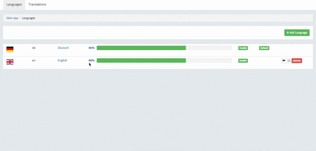

## Install

install gem

```ruby
gem 'rails-i18n'
gem 'multilang', github: 'kelevro/multilang'
```

add to `routes.rb`

```ruby
mount Multilang::Engine => '/multilang'
```
if you need authorization

```ruby
authenticate :admin do
  mount Multilang::Engine => '/multilang'
end
```

create initializer

```ruby
rails g multilang:install
```

run migrations

```ruby
rake multilang:install:migrations
rake db:migrate
```

## Configure
In
`config/initializers/multilang.rb`
edit

`config.root_path` - url for return main app

`config.force_export` - if set `true` will export after each save translation

for example

```ruby
Multilang.configure do |config|
  config.root_path    = :admin_path
  config.force_export = true
end
```

## Usage



# Export translaitons keys

After adding translations to your locales files you can run

`rake multilang:pull path=config/locales`

after thet all your tralslations will be available in multilang console. If in console key already exists this key will be skip. If you want override translation in console you can run

`rake multilang:pull force`


`rake multilang:pull` - pull to console all translation from your project
